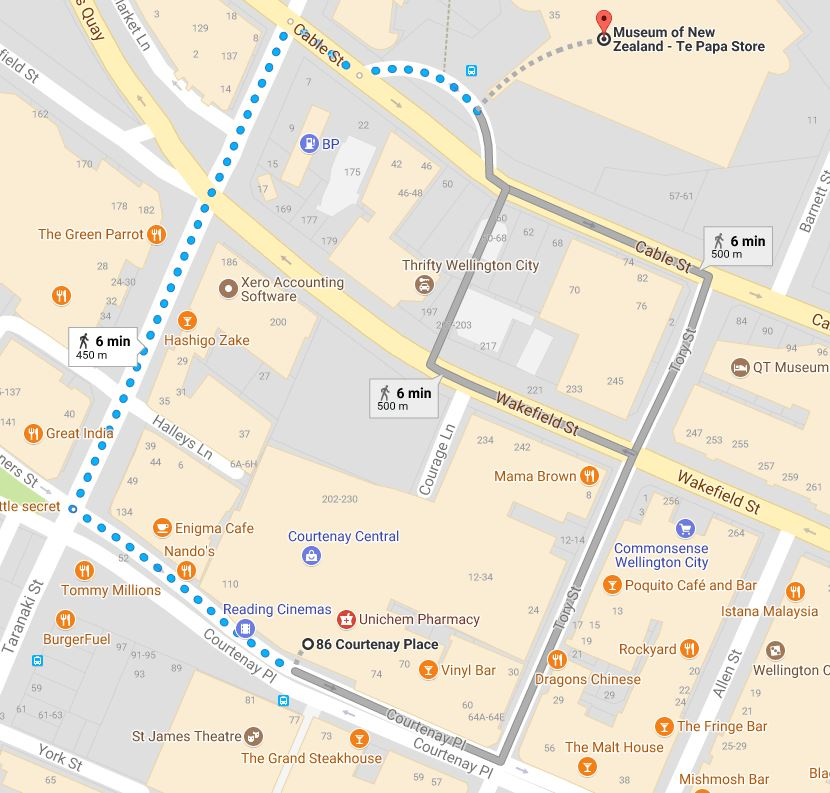
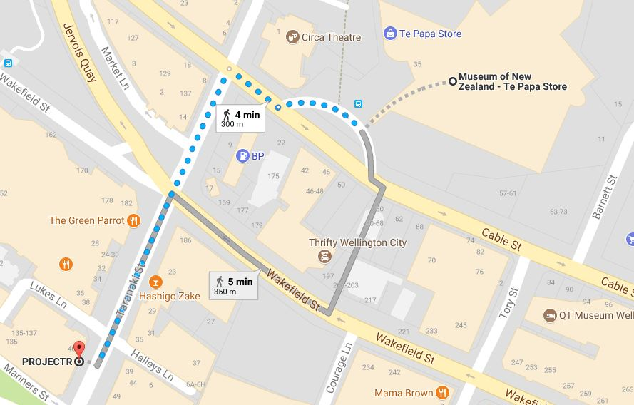

# Introduction
The 5th workshop will be held from 16th to 17th November 2017 at Victoria University in Wellington, New Zealand.

# Venue &amp; Maps

All bus infomation including routes and maps can be found at https://www.metlink.org.nz/

## Getting to Te papa
_Museum of New Zealand Te Papa Tongarewa - 55 Cable St, Te Aro, Wellington 6011_

### From Wellington International Airport
Catch the Airport Flyer Bus from Stop 7399 outside the lower floor of the airport, for 4 zones. Disembark at Stop 5000 (Courtenay Place - Paramount) and walk for 8 minutes. Total adult fare $9, Total time: 25 minutes.

### From Victoria University
This is a pleasant, 25minute 1.6km walk. If you're in a hurry, just catch a taxi, as no public transport route links these two locations.

### From the Railway Station
The #24 (Miramar Heights) is the only bus that goes directly past Te papa, but it is infrequent.
Many services go past the Courtenay Place - Courtenay Central stop from the station, which is only a 6 minute walk from Te papa. The most commmon are the #1 (Island Bay) and #2 (Miramar). 

### From the Courtenay Place bus-stops.
6 minute walk.

## Getting to ProjectR
_PROJECTR - Level 2, NEC House, 40 Taranaki St, Te Aro, Wellington 6011_

4~5 minute walk from Te papa.

## Getting to VUW
_Victoria University of Wellington - Kelburn, Wellington 6012_

### From the Railway Station

Catch the #17 (Victoria University), or #20 (Highbury) bus and get off at stop 5915 (Victoria University - Kelburn Parade). Total adult fare: $2, Total time: between 7 and 15 minutes.

### From town

Catch the #18 (Karori), #22 (Mairangi), or #47 (Johnsonville) bus and get off at stop 5915 (Victoria University - Kelburn Parade). Please note these have varying timetables and routes, so which one is best will depend where in town you are.

# Programme
Please note that this programme is provisional and subject to change.

### Day 1 - 16th November / Thursday
<table class="hdi4dprogrammetable table-left table table-striped table-bordered table-sm">
<thead>
	<tr>
		<th style="vertical-align:middle; width:12em">Day 1 (16 Nov, Thurs)</th>
		<th style="vertical-align:middle; width:2em"></th>
		<th style="vertical-align:middle"></th>
	</tr>
</thead>

<tbody>
	<tr>
        <td rowspan="1" colspan="3" class="time-table"><strong>Te papa</strong></td>
    </tr>
    <tr>
		<td rowspan="2" class="time-table">9:00am - 9:30am</td>
        <td colspan="2">Opening</td>
	</tr>
	<tr>
        <td/>
        <td>Welcome &amp; Introduction - Dr. Taehyun Rhee (VUW)</td>
    </tr>
	<tr>
		<td rowspan="5" class="time-table">9:30am - 10:30am</td>
		<td colspan="2">Presentation Session 1</td>
	</tr>
	<tr>
        <td/><td>Presentation slot 1</td>
    </tr>
	<tr>
        <td/><td>Presentation slot 2</td>
    </tr>
	<tr>
        <td/><td>Presentation slot 3</td>
    </tr>
	<tr>
        <td/><td>Presentation slot 4</td>
    </tr>
	<tr>
		<td class="time-table" class="time-table">10:30am - 11:00am</td>
		<td  class="center-table" colspan="2">Morning Tea</td>
	</tr>
	<tr>
		<td rowspan="5"  class="time-table">11:00am - 12:00pm</td>
		<td colspan="2">Presentation Session 2</td>
	</tr>
	<tr>
        <td/><td>Presentation slot 5</td>
    </tr>
	<tr>
        <td/><td>Presentation slot 6</td>
    </tr>
	<tr>
        <td/><td>Presentation slot 7</td>
    </tr>
	<tr>
        <td/><td>Presentation slot 8</td>
    </tr>
	<tr>
		<td  class="time-table">12:00pm - 1:00pm</td>
		<td class="center-table" colspan="2">Lunch</td>
	</tr>
    <tr>
        <td rowspan="1" colspan="3" class="time-table"><strong>ProjectR</strong></td>
    </tr>
	<tr>
		<td class="time-table">1:00pm - 2:00pm</td>
		<td class="center-table" colspan="2">Demos</td>
	</tr>
	<tr>
		<td class="time-table">2:00pm - 2:15pm</td>
		<td class="center-table" colspan="2">Walk to Te papa</td>
	</tr>
	<tr>
        <td rowspan="1" colspan="3" class="time-table"><strong>Te papa</strong></td>
    </tr>
	<tr>
		<td rowspan="5" class="time-table">2:15pm - 3:15pm</td>
		<td class="center-table" colspan="2">Presentation Session 3</td>
	</tr>
    <tr>
        <td/><td>Presentation slot 9</td>
    </tr>
	<tr>
        <td/><td>Presentation slot 10</td>
    </tr>
	<tr>
        <td/><td>Presentation slot 11</td>
    </tr>
	<tr>
        <td/><td>Presentation slot 12</td>
    </tr>
	<tr>
		<td  class="time-table">3:15pm - 3:45pm</td>
		<td class="center-table" colspan="2">Afternoon Tea</td>
	</tr>
	<tr>
		<td rowspan="4" class="time-table">3:45pm - 4:30pm</td>
		<td class="center-table" colspan="2">Presentation Session 4</td>
	</tr>
	<tr>
        <td/><td>Presentation slot 13</td>
    </tr>
	<tr>
        <td/><td>Presentation slot 14</td>
    </tr>
	<tr>
        <td/><td>Presentation slot 15</td>
    </tr>
	<tr>
		<td class="time-table">4:30pm - 5:00pm</td>
		<td class="center-table" colspan="2">Closing</td>
	</tr>
	<tr>
		<td  class="time-table">7:00pm</td>
		<td class="center-table" colspan="2">Dinner</td>
	</tr>
	
</tbody>
</table>

### Day 2 - 17th November / Friday
<table class="hdi4dprogrammetable table-left table table-striped table-bordered table-sm">
<thead>
	<tr>
		<th style="vertical-align:middle; width:12em">Day 2 (17 Nov, Fri)</th>
		<th style="vertical-align:middle; width:2em"></th>
		<th style="vertical-align:middle"></th>
	</tr>
</thead>

<tbody>
	<tr>
        <td rowspan="1" colspan="3" class="time-table"><strong>Victoria University of Wellington</strong></td>
    </tr>
    <tr>
		<td rowspan="2" class="time-table">???</td>
        <td colspan="2">???</td>
	</tr>
	<tr>
        <td/>
        <td>???</td>
    </tr>
</tbody>
</table>

# Registration
Registration for general attendees is now open. Please fill the form out below and we will be in contact.

<iframe src="https://docs.google.com/forms/d/e/1FAIpQLSc6_JGAzghhJRduZOZZv3PkQYukp59nE37L9JkBcRJtgZAOQQ/viewform?embedded=true" width="100%" height="600" frameborder="0" marginheight="0" marginwidth="0">Loading...</iframe>

If the form does not load, you can fill it out [here](https://goo.gl/forms/6lN20oMc9QH7GpkE3)

# Photos
Photos will be available after the event concludes.

# Contact
Primary: Dr. Taehyun Rhee (VUW) [taehyun.rhee@ecs.vuw.ac.nz](mailto:taehyun.rhee@ecs.vuw.ac.nz)

Secondary: Kieran Carnegie (VUW) [kieran.carnegie@ecs.vuw.ac.nz](mailto:kieran.carnegie@ecs.vuw.ac.nz) (+64 22 5682 768)