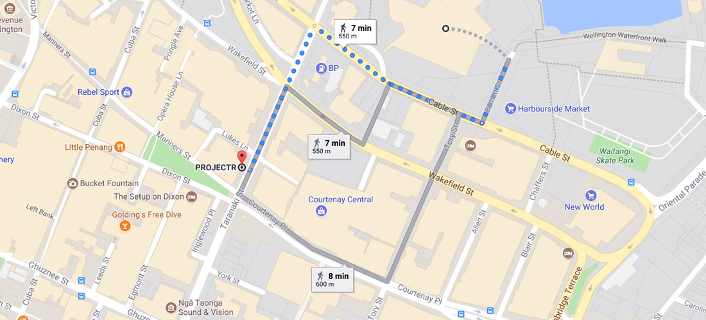

# Introduction
The HDI4D workshop is part of a New Zealand-Korea strategic research collaboration project funded by MBIE and NRF Korea.

At this workshop, we will host research presentations, demos, and a forum related to Computer Graphics, Virtual/Augmented/Mixed Reality, HCI, Film, Games, Entertainment, and other related areas.

The event will provide an opportunity to share progress and important outputs from collaborative research projects between NZ and South Korea, presentations from guest speakers as well as project members, panel discussions, and networking opportunities throughout.

There will also be lunch as well as a reception dinner, hosted by the Korean Embassy to celebrate the 20th Anniversary of signing the Arrangement on Scientific and Technological Cooperation between New Zealand and Korea.

The 5th workshop will be held from 16th to 17th November 2017 at Te Papa Tongarewa in Wellington, New Zealand.

# Venue

### Workshop
_Museum of New Zealand Te Papa Tongarewa_
Rangimarie Room 1, 55 Cable St, Te Aro, Wellington 6011

### Demo
_ProjectR_
Level 2, NEC House, 40 Taranaki St, Te Aro, Wellington 6011

### Reception Dinner
_Wellington Club Building_
Level 4, 88 The Terrace Wellington, 6011

# Programme
Please note that this programme is provisional and subject to change.

### Day 1 - 16th November / Thursday
<table class="hdi4dprogrammetable table-left table table-striped table-bordered table-sm">
<thead>
	<tr>
		<th style="vertical-align:middle; width:12em">Day 1 (16 Nov, Thurs)</th>
		<th style="vertical-align:middle; width:2em"></th>
		<th style="vertical-align:middle"></th>
	</tr>
</thead>

<tbody>
	<tr>
        <td rowspan="1" colspan="3" class="time-table"><strong>Te papa - Rangimarie Room 1</strong></td>
    </tr>
    <tr>
		<td rowspan="2" class="time-table">9:00am - 9:20am</td>
        <td colspan="2">Opening</td>
	</tr>
	<tr>
        <td/>
        <td>Welcome &amp; Introduction - A/Prof. Taehyun Rhee (VUW)</td>
    </tr>
	<tr>
		<td rowspan="5" class="time-table">9:20am - 10:40am</td>
		<td colspan="2"><strong>Presentation Session 1 - Augmented and Mixed Realities (80min)</strong></td>
	</tr>
	<tr>
        <td/><td><i>An Overview of Mixed-Reality Research at the HIT Lab NZ</i>  
		<strong >Prof. Robert W. Lindeman</strong> - HITLab NZ  </td>
    </tr>
	<tr>
        <td/><td><i>Gamification of Life - The AR Intrusion</i>  
		<strong>Taylor Carrasco</strong> - mixt</td>
    </tr>
	<tr>
        <td/><td><i>Reconstructing Depth from Mono 360 Video Based on the Camera Motion</i>  
		<strong>Joonsuk Park</strong> - Hongik Univ.</td>
    </tr>
	<tr>
        <td/><td><i>MR360: Mixed Reality Rendering for 360° Panoramic Videos</i>  
		<strong>Lohit Petikam</strong> - VUW </td>
    </tr>
	<tr>
		<td class="time-table" class="time-table">10:40am - 11:00am</td>
		<td  class="center-table" colspan="2">Morning Tea</td>
	</tr>
	<tr>
		<td rowspan="4"  class="time-table">11:00am - 12:00pm</td>
		<td colspan="2"><strong>Presentation Session 2 - VR and 4D interaction (60min)</strong> </td>
	</tr>
	<tr>
        <td/><td><i>H-Wall: Encountered-type Haptic Display for VR Environment using Per-plane Reachability Maps</i> 
		<strong>Yaesol Kim</strong> - Ewha Womans Univ.</td>
    </tr>
    <tr>
        <td/><td><i>Hand gesture-based interaction in a 360 VR movie</i> 
		<strong>Humayun Khan</strong> - HITLab NZ</td>
    </tr>
	<tr>
        <td/><td><i>Artistic Pen Drawing on an Arbitrary Surface using an Impedance-controlled Robot</i> 
		<strong>Daeun Song</strong> - Ewha Womans Univ.</td>
    </tr>
	<tr>
		<td  class="time-table">12:00pm - 1:00pm</td>
		<td class="center-table" colspan="2">Lunch</td>
	</tr>
    <tr>
        <td rowspan="1" colspan="3" class="time-table"><strong>ProjectR</strong></td>
    </tr>
	<tr>
		<td class="time-table">1:00pm - 2:00pm</td>
		<td class="center-table" colspan="2"><strong>Demos</strong></td>
	</tr>
	<tr>
        <td/><td/><td>Refer the the <strong>Demo</strong> dection below for more details on the demos. </td>
    </tr>
	<tr>
        <td rowspan="1" colspan="3" class="time-table"><strong>Te papa - Rangimarie Room 1</strong></td>
    </tr>
	<tr>
		<td rowspan="5" class="time-table">2:00pm - 3:20pm</td>
		<td class="center-table" colspan="2"><strong>Presentation Session 3 - VR Experiences (80min)</strong></td>
	</tr>
	<tr>
        <td/><td><i>Bringing Cinema Studies to VR: Film Phenomenology and Synaesthesia</i> 
		<strong>Miriam Ross</strong> - VUW</td>
    </tr>
	<tr>
        <td/><td><i>Creating Empowering, Empathic Experiences in VR</i> 
		<strong>Meredith Meyer-Nichols</strong> - Wrestler</td>
    </tr>
	<tr>
        <td/><td><i>CanvoX : High-Resolution VR Painting for Large Volumetric Canvas</i> 
		<strong>Yeojin Kim</strong> - Ewha Womans Univ.</td>
    </tr>
	<tr>
        <td/><td><i>Untethered Interactive 360 - making VR accessible</i> 
		<strong>Jessica Manins</strong> - ProjectR</td>
    </tr>
	<tr>
		<td  class="time-table">3:20pm - 3:50pm</td>
		<td class="center-table" colspan="2">Afternoon Tea</td>
	</tr>
	<tr>
		<td rowspan="4" class="time-table">3:50pm - 4:50pm</td>
		<td class="center-table" colspan="2"><strong>Presentation Session 4 - VR and Beyond (60min)</strong></td>
	</tr>
	<tr>
        <td/><td><i>Cinematic 360 Production, A Case Study: The Good, the Bad, and the Ugly</i> 
		<strong>Raqi Syed</strong> - VUW</td>
    </tr>
	<tr>
        <td/><td><i>VR|AR for Architecture and Design (provisional title)</i> 
		<strong>Tane Moleta</strong> - VUW</td>
    </tr>
	<tr>
        <td/><td><i>Overview of Research at VCG lab CG, VR/MR, and Perception</i> 
		<strong>Andrew Chalmers &amp; Kieran Carnegie</strong> - VUW</td>
    </tr>
	<tr>
		<td class="time-table">4:50pm - 5:20pm</td>
		<td class="center-table" colspan="2">Closing</td>
	</tr>
	<tr>
		<td class="time-table">5:20pm</td>
		<td class="center-table" colspan="2">Group Photo</td>
	</tr>
	<tr>
		<td  class="time-table">6:30pm</td>
		<td class="center-table" colspan="2">Dinner</td>
	</tr>
</tbody>
</table>

### Day 2 - 17th November / Friday
<table class="hdi4dprogrammetable table-left table table-striped table-bordered table-sm">
<thead>
	<tr>
		<th style="vertical-align:middle; width:12em">Day 2 (17 Nov, Fri)</th>
		<th style="vertical-align:middle; width:2em"></th>
		<th style="vertical-align:middle">Internal attendees only</th>
	</tr>
</thead>

<tbody>
	<tr>
        <td rowspan="1" colspan="3" class="time-table"><strong>Victoria University of Wellington - AM106</strong></td>
    </tr>
</tbody>
</table>

# Demos

   _Hand gesture-based Interaction in 360 VR movie_ 
<strong>Humayun Khan</strong> - HitLab NZ 

   _Haptic contact in Immersive 360 VR movie_ 
<strong>Prasanth Sasikmar</strong> - HitLab NZ 

   _CanvoX : High-Resolution Volumetric Painting for Large Space in VR_ 
<strong>Yeojin Kim</strong> - Ewha Womans Univ. 

   _An Interactive haptic feedback system for virtual hand-grasping_ 
<strong>HyunJung Kim</strong> - Ewha Womans Univ. 

   _Steradian Gallery, a virtual art experience_ 
<strong>Kevin Romond</strong> - Weta Digital 

   _MR360 Future Cinematic Composition_ 
<strong>Lohit Petikam &amp; Ian Loh</strong> - Dreamflux, VUW 

   _MR360 Underwater_ 
<strong>Stephen Thompson &amp; Andrew Chalmers</strong> - Dreamflux, VUW 

# Directions and Maps
Bus infomation including routes and maps - [metlink.org.nz](https://www.metlink.org.nz/)

Wellington Combined Taxis - [taxis.co.nz](http://www.taxis.co.nz)

Green Cabs - [greencabs.co.nz](https://www.greencabs.co.nz)

**Note:** Bus routes go in both directions. When waiting for the bus, make sure you are on the right side of the road.

## Getting to Te Papa
_Museum of New Zealand Te Papa Tongarewa_, 55 Cable St, Te Aro, Wellington 6011

### From Courtenay Place bus stops 
**5-6 minute walk.**

## Getting to ProjectR
_ProjectR_, Level 2, NEC House, 40 Taranaki St, Te Aro, Wellington 6011

### From Te Papa 
**7 minute walk.**

## Getting to Wellington Club
_Wellington Club Building_, Level 4, 88 The Terrace, Wellington, 6011
### From Te Papa (Scenic Route)
Group walk along the Wellington waterfront, before walking towards the Terrace. 
 **Total time:** ~22 minutes

### From Courtney Place
Catch the **20** (Highbury), **81** (Eastbourne), **3** (Karori), or **14** (Wilton) bus and get off at stop **5012** (Lambton Central). Walk along Lambton Quay and Woodward St. to get to the Terrace. 
 **Total adult fare:** $2  
**Total time:** ~ 11 minutes

## Getting to VUW
_Victoria University of Wellington_, Kelburn, Wellington 6012
### From the Railway Station
Catch the **17** (Victoria University) or **20** (Highbury) bus and get off at stop **5915** (Victoria University - Kelburn Parade). 
 **Total adult fare:** $2  
**Total time:** ~7-15 minutes
### From town
Catch the **18** (Karori), **22** (Mairangi), or **47** (Johnsonville) bus and get off at stop **5915** (Victoria University - Kelburn Parade). 
 **Please note:** These have varying timetables and routes, so which one is best will depend where in town you are.
## Getting to Courtney Place Bus Stops
Many services go past the Courtenay Place stop. You should be able to find most bus routes from this location.

### From Wellington International Airport
Catch the Airport Flyer Bus **91** from Stop **7399** outside the lower floor of the airport, for 4 zones. Disembark at Stop **5000** (Courtenay Place - Paramount). 
 **Total adult fare:** $9  
**Total time:** 25 minutes

## VUW Campus Map

Right click and _View Image_ to view full sized map.

# Registration
Open registration for general attendees has closed. Inviations will still be sent by email. Please contact us for more information.

# Photos
Photos will be available after the event concludes.

# Contact
Primary: A/Prof. Taehyun Rhee (VUW) [taehyun.rhee@ecs.vuw.ac.nz](mailto:taehyun.rhee@ecs.vuw.ac.nz)

Secondary: Kieran Carnegie (VUW) [kieran.carnegie@ecs.vuw.ac.nz](mailto:kieran.carnegie@ecs.vuw.ac.nz) (+64 22 5682 768)
